## TouchPortal SteamFriend Plugin
- [TouchPortal SteamFriend Plugin](#touchportal-steamfriend-plugin)
  - [Description](#description)
  - [Actions/States](#steamfriend-actions-and-states)
  	- [Actions](#actions)
 	- [States](#states)
 	- [Sates Summary](#states-summary)
  - [Installation Guide](#installation)
  - [Demo Page](#demo)
	- [Import Demo](#import-demo-page)

## Description
SteamFriend is a Plugin that allow you to see which your friend is online, offline, away etc.. and also see your own games too!

## SteamFriend Actions and States
### Actions
 - Currently This Plugin does Not have any actions 

### States
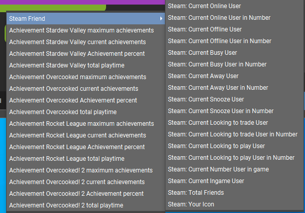

### States Summary
 - Get Current Online, Offline, Aaway, Busy, Snooze and more!
 - Get Total Friends
 - Get Total Number of Friends in-Game (Any Game)
 - Get List User In-Game
 - Get My Own Icon
 - Get Current X Game maximum achievements
   - Maximum Achievements is What is the Maximum Number of Achievements that the game have
 - Get Current X Game Current Achievements
   - Curret X Game Achievements is whats the current Number of Achievements you've reached 
 - Get Current X Game Achievement percent
   - Shows Percent of Current Achievements / Maximum Number of Achievements
 - Get Total X Game Playtime
  
 ## Installation
 1. Go to <a target="_blank" href="https://github.com/KillerBOSS2019/TP-Steam-Friend-Plugin/releases" > Releases </a> on the main page of this github.
 2. Make sure download right file for your system **Mac-TouchPortalSteamPlugin.tpp** is for macOS users and **Win-TouchPortalSteamPlugin.tpp** for Windows 10 users.
 3. After you have the file head over to touchportal app on your Mac/Win pc.
 4. On the top right click the wrench icon.  
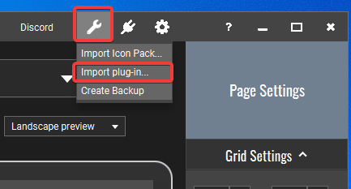
 5. Click `Import plugin-in...` and select the .tpp file you've downloaded in step 2.
 6. Next we need to get an API Key to retrieve data from Steam.(All data is only transfered between Steam and you. I do not collect any data. Feel free to check my code!)  
 7. Go to the following Steam website to attain an [Steam API Key](https://steamcommunity.com/dev/apikey)
    - Login to your steam account if you reach this login page:  
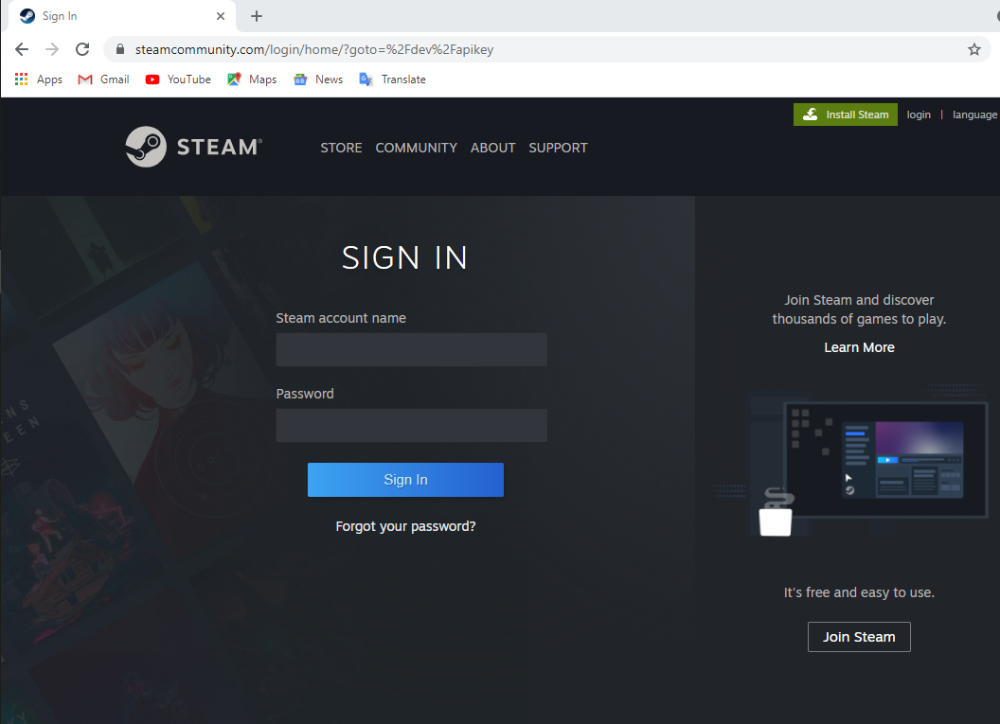
    - If are already logged in you will see the API key registration page:  
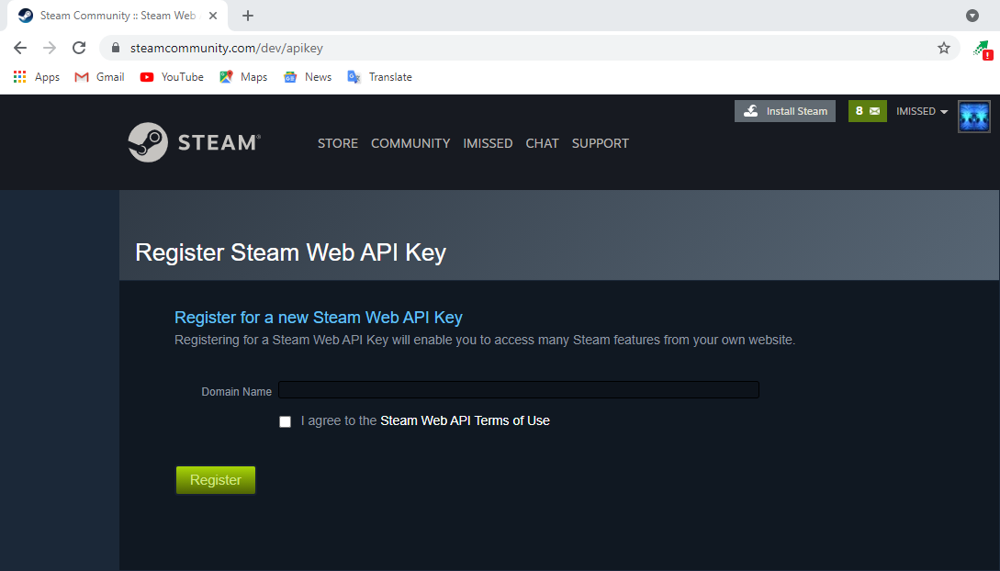
 8. For me i just entered `TPSteamPlugin` for the domain name and checked the box next to `I agree to the Steam Web API Terms of Use` and clicked the green register button.  
 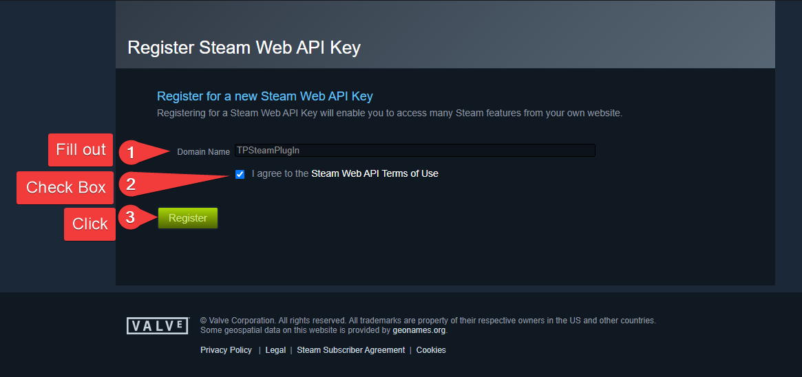
 9. After You Clicked Register it will generate your personal API Key. (You can comeback to the same page to revoke the API Key)
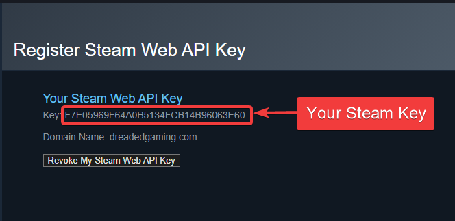
 10. The API key that I got was `F7E05969F64A0B5134FCB14B96063E60` (This Key is just a example It wont work for you!)  
 11. Save the API key in Notepad for later use.
 12. On the same page click your profile picture in the top right.  
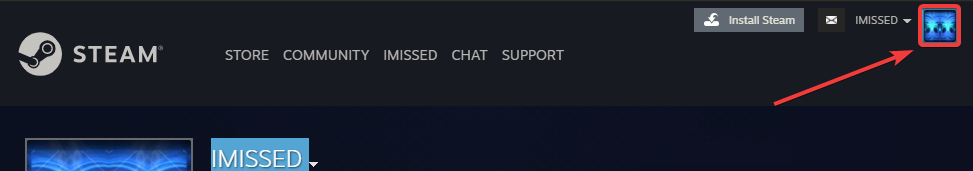
 13. Your profile page will look something simalar to this.  
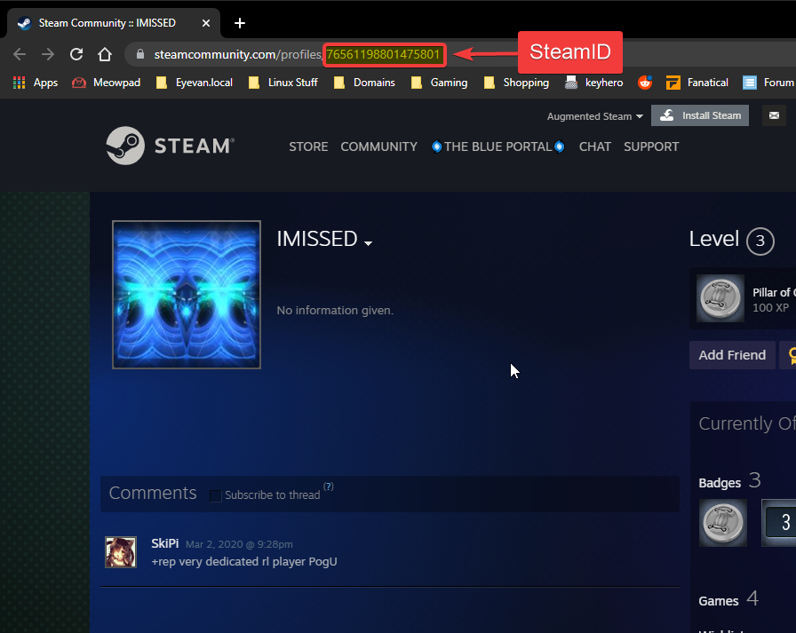
 14. Copy highlighted 17 digit number SteamID in the URL and copy it to Notepad for later use like this:  
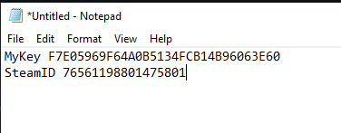
 15. Now that we have the API Key and your SteamID goto the TouchPortal App On Desktop again Click the cog icon. 
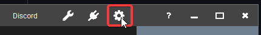 
 16. This will open another window.
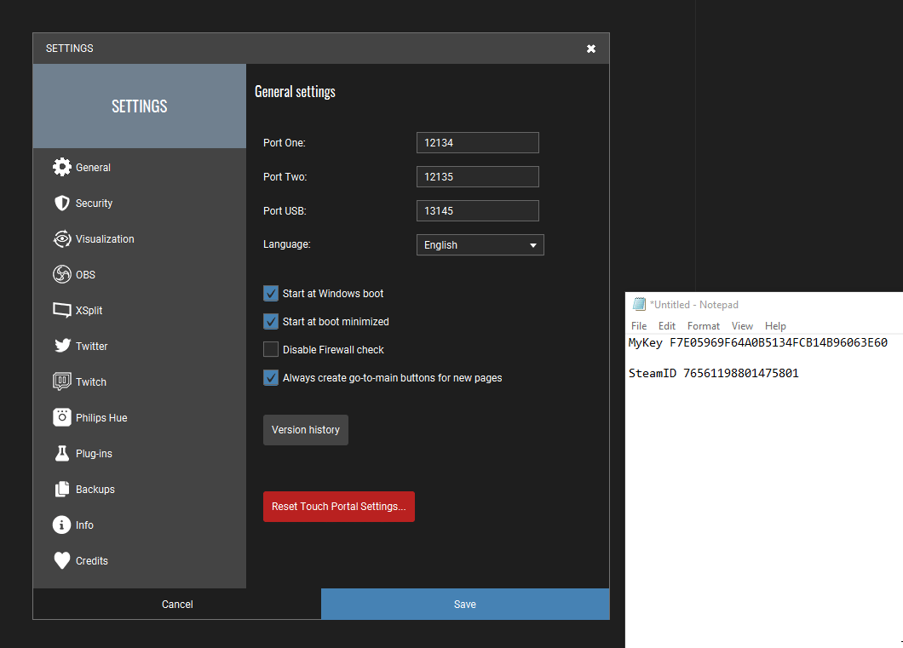
 17. Click Plug-ins.  
 18. You will see a drop-down menu next to the `Import plug-in...` Button, if not restart TouchPortal.  
 19. Enter in the SteamID and the API Key into their respective fields.
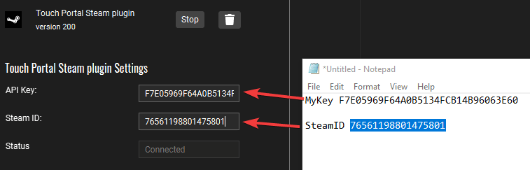
 20. After You inserted everything Click Save.
 21. After you've saved the settings you should go back to the settings again and select steam plugin you should see status shows `Connected` just like this:  
 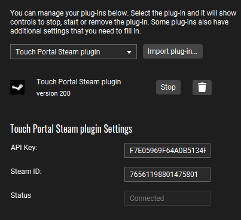

## Demo
A Demo page that shows off some of the features and functionality of TouchPortal Plugin can be found [Here](https://github.com/cj2tech/TP-Steam-Friend-Plugin/blob/main/Demo/steam-friends.tpz).
Once install it will look like the image below
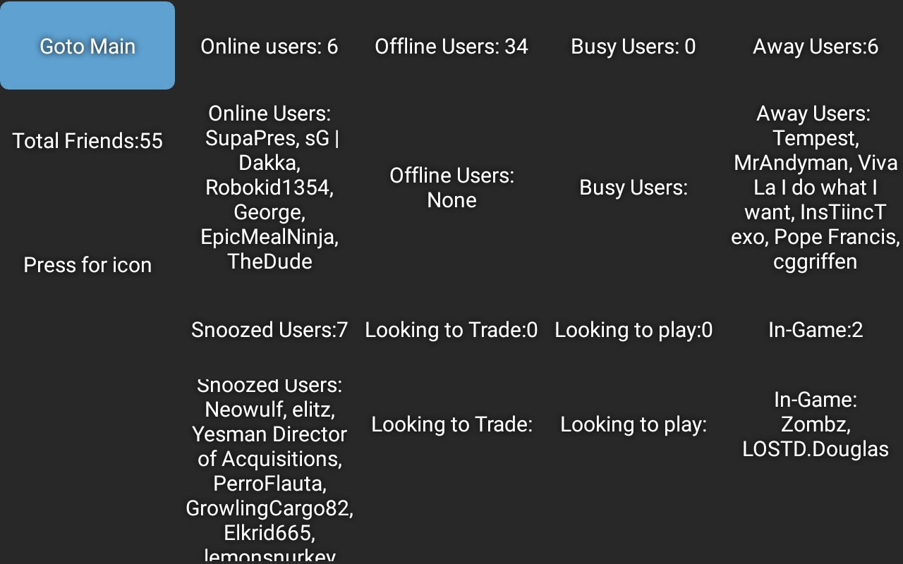

### Import Demo Page
 1. Download demo page from [Here](Demo/steam-friends.tpz).  
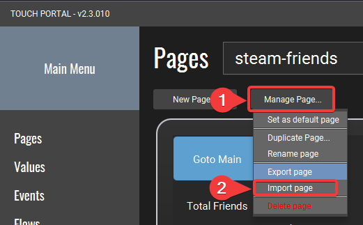
 2. Click "Manage Page..." button on Touch Portal Main Menu. 
 3. Click "Import Page"
 4. Find the downloaded file steam-friends.tpz and click open  
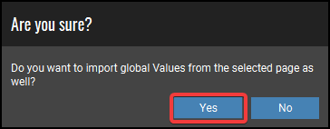
 5. Click Yes when this pop-up appears  
![image]
 6. Click Ok button to close the import confirmation page  
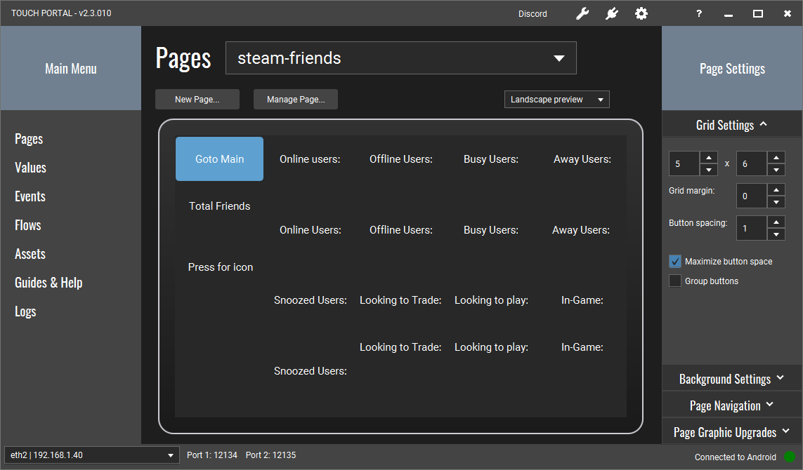
 7. You will now have a new page named steam-friends showing of most fuctions of the plugin.
*Note: Though the page in touch portal does look like it's not doing anything it is. You will see it update with infomation once you are using the app on a device.*  

